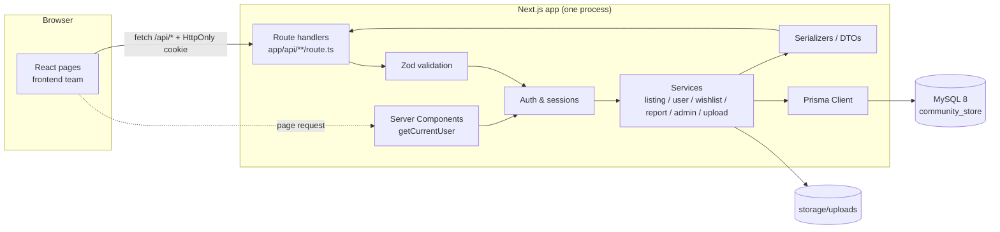
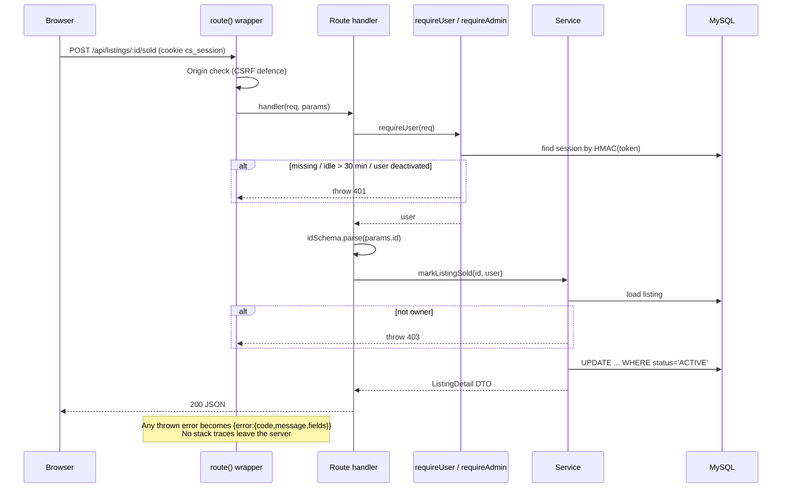
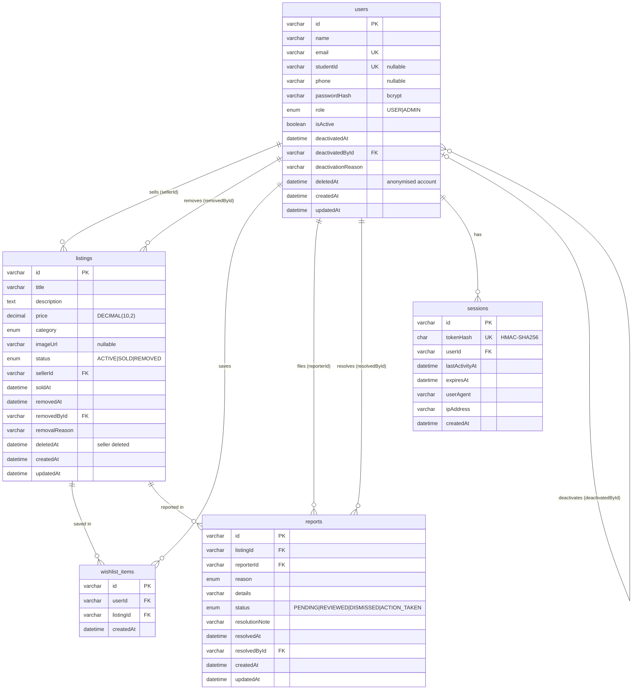
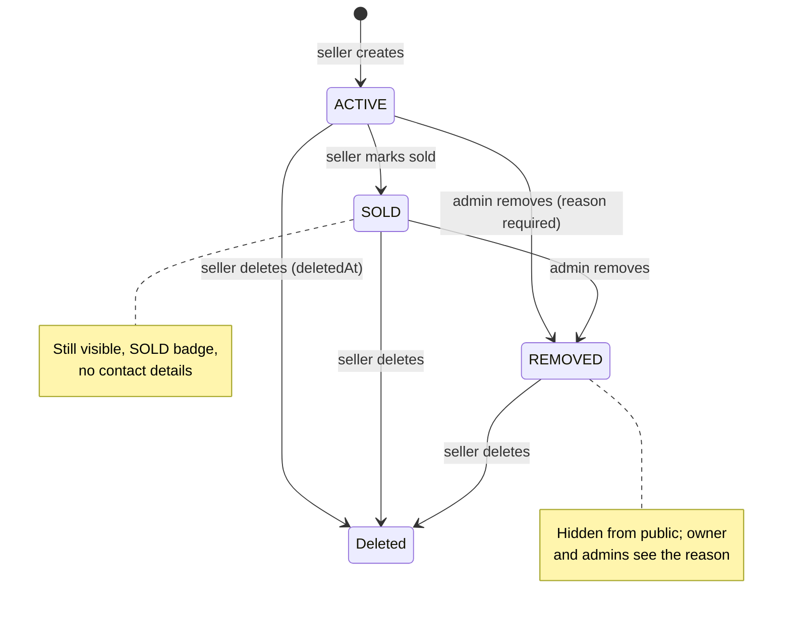
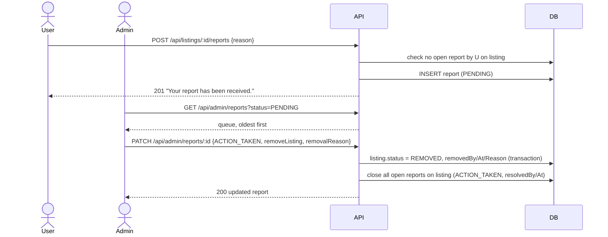

# Community Store: Technical & System Design

Owner: Backend & Database (Musoyenkosi)
Covers the backend responsibilities: database design, architecture, API design, technical requirements and system diagrams.

---

## 1. Architecture overview

One Next.js application (App Router) holds both the frontend pages and the backend API. There is no separate backend server. The backend is organised in layers so that the "controllers / services / entities" roles map onto the code:

| Layer | Where | Responsibility |
|---|---|---|
| **Controllers** | `app/api/**/route.ts` | Parse the request, validate with Zod, check who is calling, call a service, return JSON with the right status code |
| **Services** | `lib/services/*.ts` | Business rules: ownership checks, state changes (ACTIVE → SOLD → ...), moderation, transactions |
| **Validation** | `lib/validations.ts` | Zod schemas for every body and query string |
| **Auth / sessions** | `lib/auth.ts`, `lib/session.ts`, `lib/current-user.ts` | Password hashing, session cookies, `requireUser` / `requireAdmin` |
| **Serializers (DTOs)** | `lib/serializers.ts` | Decide exactly which fields leave the server |
| **Entities / data access** | `prisma/schema.prisma`, `lib/prisma.ts` | Prisma models and the single shared DB client |
| **Database** | MySQL 8 (`community_store`) | Storage, constraints, indexes |

### Request lifecycle (every API call)

---

## 2. Database design

### Entity-relationship diagram

### Key design decisions

| Decision | Reason |
|---|---|
| **Category as an enum**, not a table | The six categories are fixed by the requirements. An enum is enforced by MySQL and needs no join. Display labels live in `lib/constants.ts`. |
| **Price is `DECIMAL(10,2)`** | Exact money values; no floating-point rounding. The API returns prices as strings (`"250.00"`). |
| **Soft delete for listings** (`deletedAt`) | A seller's delete hides the listing everywhere, but reports that point to it survive. Hard-deleting would silently erase moderation history. |
| **Admin removal = status `REMOVED`** + `removedById`, `removalReason`, `removedAt` | Satisfies "store admin ID, listing ID, reason, timestamp". The owner can still see why it was removed. |
| **Accounts are anonymised, not deleted** | Personal data is wiped and the email is freed, but foreign keys from reports stay valid. |
| **Deactivation audit** (`deactivatedById`, `deactivatedAt`, `deactivationReason`) | Records which admin deactivated whom. |
| **`wishlist_items (userId, listingId)` unique** | The database itself blocks duplicate wishlist entries. |
| **One open report per user per listing** | Checked in the service (`PENDING`/`REVIEWED`), so the same user can report again after a report is closed. |
| **Sessions store `tokenHash` only** | A leaked DB dump can't be turned into working cookies. |

### Referential actions

| Foreign key | On delete | Why |
|---|---|---|
| listings.sellerId → users | RESTRICT | Users are never hard-deleted; guards against accidents |
| listings.removedById → users | SET NULL | Keep the listing if an admin row ever goes |
| wishlist_items.* → users / listings | CASCADE | A wishlist entry has no meaning without both |
| reports.listingId / reporterId | RESTRICT | Moderation history must not disappear silently |
| reports.resolvedById, users.deactivatedById | SET NULL | Keep the record even without the admin |
| sessions.userId → users | CASCADE | Sessions die with the user |

### Indexes (and the query each one serves)

| Index | Query |
|---|---|
| `listings (status, deletedAt, createdAt)` | Browse page: public listings, newest first |
| `listings (category, status, createdAt)` | Category filter |
| `listings (sellerId, status)` | Seller profile, My Listings, dashboard counts |
| `listings (title)` | Title lookups/sorting in admin |
| `reports (status, createdAt)` | Admin report queue |
| `reports (listingId, reporterId, status)` | Duplicate-report check |
| `users (email)` UNIQUE, `users (studentId)` UNIQUE | Login, registration uniqueness |
| `sessions (tokenHash)` UNIQUE | Session lookup on every request |
| `sessions (expiresAt)` | Cleanup of expired sessions |

**Search note:** keyword search uses `LIKE '%term%'` (via Prisma `contains`) over title and description, combined with the indexed category/status filters and pagination. That is fine at the target scale (1,000+ listings). If the dataset grows to tens of thousands, the upgrade path is a MySQL `FULLTEXT` index on `(title, description)` using Prisma's `fullTextIndex` preview feature.

---

## 3. Listing lifecycle

## 4. Report moderation flow

---

## 5. Security design

| Threat | Control |
|---|---|
| Password theft | bcrypt (cost 12). Passwords never stored or returned. bcrypt's 72-byte limit enforced in validation. |
| Account enumeration | Same "Invalid email or password" message and same timing for unknown emails (dummy bcrypt compare). Deactivation is only revealed after a correct password. |
| Session theft (XSS) | Session token lives only in an **HttpOnly** cookie; nothing in localStorage. |
| Session fixation | Login destroys any existing session from that browser before issuing a new one. |
| Stale sessions | 30-minute inactivity timeout (requirement), 12-hour absolute cap. Deactivation and password change revoke sessions. |
| CSRF | `SameSite=Lax` cookie, plus an Origin check on every non-GET request. |
| SQL injection | All queries go through Prisma (parameterised). The only raw SQL is the constant `SELECT 1` health check. |
| XSS via content | The API returns JSON only. React escapes output. Image URLs are restricted to http(s) or our own upload path (no `javascript:`/`data:`). Control characters are stripped from text. |
| Privilege escalation | `requireAdmin` on every admin route. Admins can't deactivate themselves or the last admin. Unknown body fields such as `role`, `sellerId` and `status` are rejected. |
| IDOR (editing others' data by changing IDs) | Ownership is checked in the service layer against the session user, never taken from the request. Tested. |
| Malicious IDs / params | Every ID and query param is validated with Zod before it reaches the DB. |
| Upload abuse | Auth required, 2 MB limit, type detected from file bytes (JPEG/PNG/WebP only), random server-side file names, strict filename whitelist on read (no path traversal). |
| Error leakage | One error handler converts everything to `{error:{code,message}}` with no stack traces or SQL errors. |
| Secrets in git | `.env` ignored; only `.env.example` committed. |

---

## 6. Non-functional requirements

| Requirement | Target | How the backend supports it |
|---|---|---|
| Page load | < 3 s | Server-side queries with indexes; paginated responses (12 by default, max 50) |
| Search response | < 2 s | Filtering and search run in MySQL, not the browser; indexed filters; `count` + `findMany` in one transaction |
| Scale | 1,000+ listings | Pagination everywhere; composite indexes on the hot queries; seller data fetched via a `select` join, not N+1 |
| Availability | 99% uptime (deployment target) | `/api/health` checks the DB for uptime monitors; a single shared Prisma client prevents connection exhaustion. Uptime itself depends on hosting, not on local development. |
| Session security | 30 min inactivity | Enforced server-side in `lib/session.ts`; covered by tests |

These are targets the design supports, not guarantees. They should be measured on the deployed system.

---

## 7. Scope decisions

The backend role description lists some items that the project specification puts **out of scope**. They are deliberately not built:

| Role item | Decision | In-scope equivalent |
|---|---|---|
| Orders / cart | Not built: the spec excludes cart and checkout | Wishlist, Mark as Sold |
| Payments | Not built: no in-app financial transactions | Buyers contact sellers by email/phone |
| Reviews / ratings | Not in the spec | (Future work) |
| Notifications | Not in the spec | Admin dashboard shows the pending-report count |
| Product management | Implemented as **Listing** management | Listings CRUD, sold, moderation |

---

## 8. Requirement traceability (backend)

| Requirement | Endpoint(s) | Test file |
|---|---|---|
| Register (name, email, password, optional student ID) | `POST /api/auth/register` | `auth.test.ts` |
| Login / logout, reject inactive users | `/api/auth/login`, `/api/auth/logout` | `auth.test.ts` |
| 30-min inactivity expiry | session layer | `auth.test.ts` |
| Create / edit / delete own listing | `/api/listings`, `/api/listings/:id` | `listings.test.ts` |
| Reject editing another user's listing | `PATCH /api/listings/:id` | `listings.test.ts` |
| Mark as sold, sold not contactable | `POST /api/listings/:id/sold` | `listings.test.ts` |
| Browse without login, newest first, pagination | `GET /api/listings` | `listings.test.ts` |
| Search + multi-category filter | `GET /api/listings?q=&categories=` | `listings.test.ts` |
| Seller profile | `GET /api/users/:id` | `listings.test.ts` |
| Report listing, duplicates blocked | `POST /api/listings/:id/reports` | `reports-admin.test.ts` |
| Admin-only access | `/api/admin/*` | `reports-admin.test.ts` |
| Admin removes listing with reason (stored) | `DELETE /api/admin/listings/:id` | `reports-admin.test.ts` |
| Admin resolves / dismisses reports | `PATCH /api/admin/reports/:id` | `reports-admin.test.ts` |
| Admin deactivates users | `PATCH /api/admin/users/:id` | `reports-admin.test.ts` |
| Wishlist add / remove / no duplicates | `/api/wishlist` | `wishlist-profile.test.ts` |
| Profile view / edit / delete account | `/api/users/me` | `wishlist-profile.test.ts` |

---

## 9. Backend sprint mapping

| Sprint | Backend work |
|---|---|
| 1: Setup | Repo, Next.js + TypeScript, Prisma + MySQL connection, `.env.example`, auth foundation (sessions, bcrypt) |
| 2: Requirements/design | Prisma schema + `schema.sql`, ERD, Zod validation, listing search/filter design, API contract (`docs/API.md`) |
| 3: Core | Auth routes, listings CRUD, browse/search/filter, detail, seller profile, mark sold, ownership security |
| 4: Administration | Admin stats, user deactivation, listing removal, reports, wishlist, index tuning |
| 5: Testing/submission | Integration tests, Postman collection, bug fixes, README, frontend integration support |
